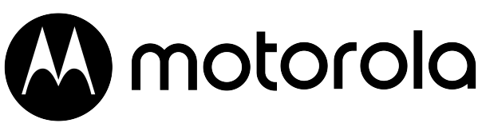

# Motorola Project by Suryansh Niranjan

Explore the seamless blend of technology and innovation with the **Motorola Project**, a web application designed to showcase the essence of Motorola's premium products. Deployed live at [Motorola by Nerd Developer Suryansh Niranjan](https://motorola-by-nerd-developer-suryansh.netlify.app/), this project delivers an immersive user experience with a focus on cutting-edge design and functionality.

## Key Highlights
- **Modern Design**: Experience a clean, responsive, and visually appealing layout tailored for tech enthusiasts.
- **Dynamic Content**: From the home page's sleek product carousel to the detailed accessories section, every element is crafted for user engagement.
- **Interactive Features**: Whether you're exploring the latest accessories or logging in via the contact page, the application ensures seamless navigation and usability.
- **Tech Integration**: Leveraging GSAP animations and FontAwesome icons, the project offers a professional and polished interface.

## What You Can Do
- **Discover Accessories**: Browse through Motorola's top accessories like earbuds, fast chargers, and portable speakers, complete with purchase links.
- **Stay Connected**: Use the intuitive contact page to register or log in.
- **Quick Navigation**: Easily explore the application through a well-structured menu and search functionality.

## Built By
This project was brought to life by **Suryansh Niranjan**, combining a passion for technology with web development expertise. The application is hosted on Netlify, ensuring fast performance and reliability.

## Experience It Now
Dive into the Motorola experience by visiting the live project: [Motorola by Suryansh Niranjan](https://motorola-by-nerd-developer-suryansh.netlify.app/).

